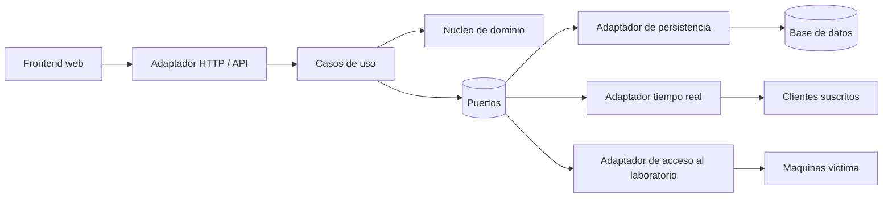

# Plataforma CTF de Entrenamiento en Ciberseguridad

## Descripción

Plataforma web de entrenamiento en ciberseguridad con experiencia estilo CTF
(Capture The Flag), diseñada para un laboratorio académico. Permite que los
estudiantes resuelvan retos asociados a escenarios de ataque, envíen flags y
reciban una validación, puntuación y seguimiento de su progreso.

La plataforma es la capa de entrenamiento, interacción y evaluación del
laboratorio. **No reemplaza a Security Onion ni es el mecanismo de detección**:
Security Onion conserva sus funciones de monitoreo y detección.

## Objetivos

- Proporcionar un entorno controlado para practicar escenarios de ataque.
- Relacionar los retos con técnicas de MITRE ATT&CK y distintos niveles de
  dificultad.
- Validar flags y registrar los intentos de los jugadores.
- Medir el avance mediante puntuación, progreso y ranking.
- Facilitar a los instructores la organización de retos y a los estudiantes el
  acceso a las máquinas víctima autorizadas.

## Características principales

- Autenticación y control de acceso basado en roles (RBAC).
- Gestión de usuarios.
- Gestión de retos.
- Definición y validación de flags.
- Registro de intentos.
- Ranking y progreso del jugador.
- Filtrado de retos por dificultad.
- Filtrado por técnica MITRE ATT&CK.
- Instrucciones de acceso a máquinas víctima.
- Actualización del ranking en tiempo real.
- Exportación de reportes y del ranking.

## Niveles de dificultad

La dificultad representa la complejidad del reto y determina su puntuación:

| Nivel | Puntos |
| --- | ---: |
| Básico | 100 |
| Medio | 250 |
| Avanzado | 500 |

## Escenarios CTF

Los escenarios agrupan retos relacionados con una técnica MITRE ATT&CK, una
dificultad y una o más máquinas víctima del laboratorio. Las flags se validan
como parte del flujo de resolución del reto.

| Escenario | Técnica MITRE ATT&CK | Dificultad | VM(s) víctima | Flags |
| --- | --- | --- | --- | --- |
| `ESC-01-RECON` | T1046 — Network Service Scanning | Básico | `LAB-LNXVICT`, `LAB-SRVWEB` | Flags de reconocimiento |
| `ESC-02-BRUTEFORCE` | T1110.001 — Password Guessing | Medio | Máquinas víctima del laboratorio | Flags de fuerza bruta |
| `ESC-03-WEBEXPLOIT` | T1190 — Exploit Public-Facing Application | Medio | `LAB-SRVWEB` | Flags de explotación web |
| `ESC-04-LATERAL` | T1021.002 — SMB/Windows Admin Shares | Avanzado | `LAB-LNXVICT` | Flags de movimiento lateral |
| `ESC-05-EXFIL` | T1048 — Exfiltration Over Alternative Protocol | Avanzado | Máquinas víctima del laboratorio | Flags de exfiltración |

Las instrucciones de cada reto delimitan el alcance de las actividades y los
activos autorizados. Las flags concretas pertenecen a la configuración del
reto y no se documentan en este archivo.

## Roles

El control de acceso utiliza **RBAC (Role-Based Access Control)**.

| Rol | Responsabilidades |
| --- | --- |
| Administrador | Gestionar usuarios, roles y la configuración general de la plataforma. |
| Instructor / Diseñador de retos | Diseñar, gestionar y publicar retos, flags e instrucciones. |
| Jugador (Estudiante) | Consultar retos, acceder al laboratorio autorizado, enviar flags y revisar su progreso y posición. |
| Invitado (opcional) | Consultar el contenido que la configuración permita sin participar en la evaluación. |

## Arquitectura

La plataforma utiliza **Arquitectura Hexagonal (Ports & Adapters)** para
separar las reglas del dominio de la infraestructura:

- **Núcleo de dominio:** entidades y reglas de retos, flags, puntuación,
  progreso y ranking.
- **Casos de uso:** autenticación, gestión de retos, validación de flags,
  registro de intentos, actualización del ranking y gestión del acceso a
  máquinas víctima.
- **Puertos:** contratos que el núcleo utiliza para persistencia, publicación
  de eventos y acceso al laboratorio.
- **Adaptadores:** API HTTP, interfaz web, base de datos, comunicación en
  tiempo real y acceso remoto al laboratorio.
- **Persistencia:** almacenamiento de usuarios, retos, flags, intentos,
  progreso y resultados.
- **Comunicación en tiempo real:** publicación de cambios para mantener
  actualizado el ranking.



Security Onion permanece fuera de este flujo como componente de monitoreo y
detección del laboratorio.

## Patrones de diseño

- **Strategy:** permite encapsular y seleccionar la estrategia de validación
  de flags o de resolución de un reto.
- **Repository:** abstrae el acceso a usuarios, retos, flags, intentos y
  resultados persistidos.
- **Observer / Publicador-Suscriptor:** comunica cambios del ranking a los
  clientes conectados en tiempo real.
- **Factory:** centraliza la creación de adaptadores y objetos de ejecución
  según la configuración del entorno.

## Stack tecnológico

| Componente | Tecnología |
| --- | --- |
| Backend | Python + FastAPI |
| Frontend | React + TypeScript + TailwindCSS |

La ejecución local utiliza Docker Compose para levantar la aplicación y sus
servicios de soporte definidos por el proyecto.

## Ejecución general

### Requisitos

- Docker y Docker Compose.
- Un archivo de configuración basado en [`.env.example`](./.env.example).

### Inicio

1. Copia `.env.example` como `.env`.
2. Configura en `.env` las contraseñas y secretos del entorno.
3. Ejecuta:

   ```bash
   docker compose up --build
   ```

4. Abre `http://localhost:8081` (o el puerto definido mediante `WEB_PORT`).

La documentación interactiva de la API está disponible en `/docs` cuando el
servicio está en ejecución.

## Relación con el laboratorio

La plataforma entrega el contexto de los retos, las instrucciones y el acceso
controlado a las máquinas víctima. El laboratorio conserva la separación entre
los activos de entrenamiento y el monitoreo. Las actividades de los jugadores
deben limitarse a los escenarios y activos autorizados por el instructor.

## Documentación adicional

- [Configuración de entorno](./.env.example)
- [Backend](./backend/)
- [Frontend](./frontend/)
- Documentación interactiva de la API: `/docs` con la aplicación ejecutándose


## Fase A — banderas dinámicas

La base de implementación se documenta en `docs/FASE_A_BANDERAS_DINAMICAS.md`.
El inyector SSH está deshabilitado por defecto y requiere configuración por
variables de entorno.
